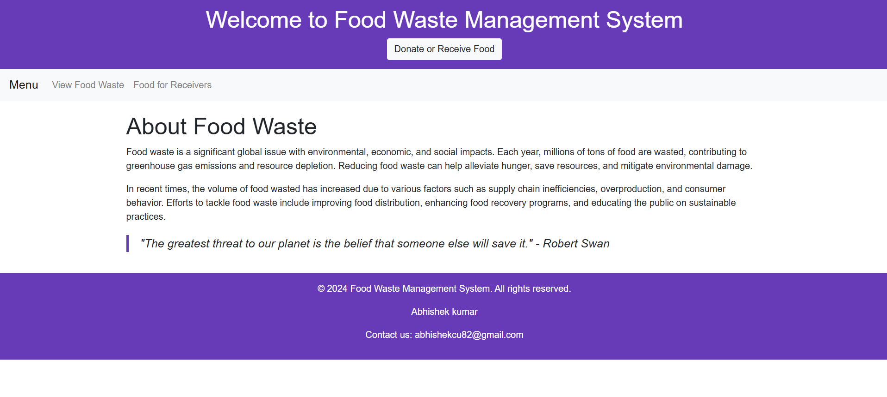

# Food Waste Reduction System

A Java Spring Boot web application to connect food donors and receivers in real-time.

## Features
- Donor and Receiver Roles
- Food listing with expiry
- Secure authentication
- MySQL integration

## Technologies Used
- Java
- Spring Boot
- MySQL
- HTML, CSS, Bootstrap
- Docker (optional)

## How to Run
1. Clone the repository
2. Run MySQL server and configure `application.properties`
3. Use `mvn spring-boot:run` to start the backend

## 📷 Screenshots
- HOME

- MENU

